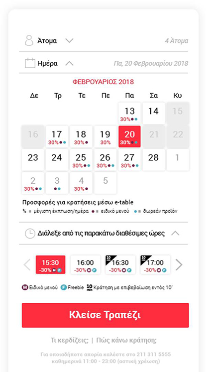

# Ορισμοί και γενικές έννοιες

Οι παρακάτω έννοιες είναι απαραίτητες για την κατανόηση του API και της λειτουργίας των online κρατήσεων μέσω e-table.

## Εστιατόριο (Store)

Κάθε εστιατόριο έχει ένα μοναδικό Store ID ή slug. Ένα εστιατόριο μπορεί να είναι ενεργό (active), δηλαδή listable στο e-table, ή ανενεργό (inactive) π.χ. όταν έχει κλείσει οριστικά ή έχει διακόψει τη συνεργασία με το e-table. 

Μέσω του API έχετε πρόσβαση μόνο στα active εστιατόρια.

### Σχετικά endpoints:

- [Get store object](./technical.md#get-store-object)
- [Get a list of stores by searchable criteria](./technical.md#get-a-list-of-stores-by-searchable-criteria)
- [Get store booking schedule](./technical.md#get-store-booking-schedule)

## Πόλη (City)

Η πόλη μπορεί να είναι επίσης νησί ή νομός, π.χ. Αθήνα, Χανιά, Χαλκιδική, Μύκονος κτλ. και αποτελεί το υψηλότερο επίπεδο στην ιεραρχία της τοποθεσίας ενός εστιατορίου. 

Η πόλη είναι απαραίτητη στα listings εστιατορίων καθώς η ανάγκη της αναζήτησης/κράτησης εστιατορίου είναι city based. Δηλαδή ένας χρήστης προτού δει εστιατορια θα πρέπει να έχει επιλέξει πόλη (default η Αθήνα στο homepage του e-table) καθώς δεν έχει νόημα να ψάχνει ταυτόχρονα εστιατόρια σε διαφορετικές πόλεις.

## Χρήστης (User)

Οι χρήστες της υπηρεσίας. Κάθε χρήστης έχει User ID, email ενώ για να πραγματοποιήσει κράτηση θα πρέπει να καταχωρήσει ονοματεπώνυμο και κινητό τηλέφωνο. Στην διασύνδεση σε web απαιτείται validation κινητου τηλεφώνου με αποστολή SMS (την πρώτη φορά μόνο) αλλά στη διασύνδεση με mobile app το validation είναι προαιρετικό.

### Σχετικά endpoints:

- [Create a user object](./technical.md#create-a-user-object-aka-register)
- [Get a user object](./technical.md#get-a-user-object-aka-login)
- [Remove reservations and users created for testing purposes](./technical.md#remove-reservations-and-users-created-for-testing-purposes)

## Κράτηση (Reservation)

Η βασική οντότητα του e-table. Εκτός από εστιατόριο και στοιχεία χρήστη, μια κράτηση πρέπει να έχει ημερομηνία, ζώνη ώρας, άτομα και ώρα προσέλευσης.

Σημειώνεται ότι το API επιτρέπει μόνο την δημιουργία (post) κράτησης και όχι την ακύρωση ή τροποποίηση μια κράτησης. Η ακύρωση ή τροποποίηση μπορεί να γίνεται μέσω με login στο e-table ή ακολουθώντας το link που υπάρχει στο email επιβεβαίωσης κράτησης που λαμβάνει ένας χρήστης μετά την επιτυχημένη καταχώρηση της κράτησης του.

Σημειώνεται ότι το API επιτρέπει μόνο την δημιουργία (post) κράτησης και όχι την ακύρωση ή τροποποίηση μια κράτησης. Η ακύρωση ή τροποποίηση μπορεί να γίνεται μέσω με login στο e-table ή ακολουθώντας το link που υπάρχει στο email επιβεβαίωσης κράτησης που λαμβάνει ένας χρήστης μετά την επιτυχημένη καταχώρηση της κράτησης του.

### Σχετικά endpoints:

- [Add new reservation](./technical.md#add-new-reservation)
- [Get completed reservations status](./technical.md#get-completed-reservations-status)
- [Remove reservations and users created for testing purposes](./technical.md#remove-reservations-and-users-created-for-testing-purposes)

### Σενάρια καταχώρησης κράτησης

**Καταχώρηση κράτησης με ή χωρίς χρήστη**

Μια κράτηση μπορεί να καταχωρηθεί ακόμα και αν δεν είναι γνωστό το user_id του χρήστη (δηλαδή χωρίς να έχει προηγηθεί login ή signup) χρησιμοποιώντας ένα email. Αν το email υπάρχει στη βάση του e-table τότε το endpoint επιστρέφει σχετικό μήνυμα οπότε και θα πρέπει να δώσουμε στον χρήστη την επιλογή να κάνει login ή να χρησιμοποιήσει άλλο email.

Στην περίπτωση της επιτυχημένης καταχώρησης κράτησης το e-table δημιουργεί παράλληλα έναν νέο χρήστη οπότε και αποστέλλονται σχετικές οδηγίες μέσω email. Οι οδηγίες αυτές είναι πολύ σημαντικές γιατί δίνουν στον χρήστη τη δυνατότητα να διαχειριστεί την κράτηση του, δηλαδή να την ακυρώσει ή να την τροποποιήσει.

Κατά συνέπεια, στο μήνυμα success στο UI θα πρέπει να εμφανίζεται κάθε φορά το εξής λεκτικό:

> Η κράτησή σας καταχωρήθηκε με επιτυχία για Τετάρτη 18/07/2018 στις 19:30!
>
> ΔΕΝ χρειάζεται να πάρετε τηλέφωνο το εστιατόριο. Στην έκτακτη περίπτωση που προκύψει οποιοδήποτε θέμα θα επικοινωνήσουμε άμεσα μαζί σας στο κινητό που μας δώσατε. Καλή σας Διασκέδαση
>
> Ακύρωση ή Τροποποίηση Κράτησης: Ακολουθήστε τις οδηγίες στο email που σας έχει αποσταλεί ή εναλλακτικά επικοινωνήστε με το e-table στο 211-311-5555 (καθημερινά 11:00 - 23:00, αστική χρέωση)

**Καταχώρηση κράτησης με νέο κινητό τηλέφωνο**

Για να καταχωρηθεί μια κράτηση απαιτείται να εισάγει ο χρήστης ένα κινητό τηλέφωνο. Για την καταχώρηση και κινητών άλλων χωρών θα πρέπει να καταχωρείται ο κωδικός χώρας ξεχωριστά. Στην περίπτωση που το κινητό τηλέφωνο χρησιμοποιείται 1η φορά (άσχετα αν ο χρήστης υπάρχει ή πρόκειται να δημιουργηθεί), απαιτείται validation με αποστολή 4ψήφιου κωδικού με SMS (εκτός και αν έχει συμφωνηθεί κάτι άλλο με το e-table).

Στην περίπτωση αυτή το endpoint επιστρέφει σχετικό μήνυμα οπότε και θα πρέπει να καταχωρηθεί ο κωδικός που εστάλει στον χρήστη. 

Μόλις η κράτηση καταχωρηθεί επιτυχώς, επιστρέφεται σχετικό μήνυμα με τον κωδικό του χρήστη και τον κωδικό της κράτησης.

**Καταχώρηση δοκιμαστικών κρατήσεων**

Το endpoint επιτρέπει την καταχώρηση test κρατήσεων μέσω της optional παραμέτρου test_mode. Μπορείτε να κάνετε όσες test κρατήσεις θέλετε. Εναλλακτικά, μπορείτε να καταχωρείτε κανονικές κρατήσεις στα [δοκιμαστικά εστιατόρια](#δοκιμαστικά-εστιατόρια).

## Ζώνη ώρας (Zone)

Για να γίνει μια κράτηση πρέπει να υπάρχουν διαθέσιμες θέσεις (δηλαδή τραπέζια) από το εστιατόριο. Η διαθεσιμότητα αυτή του εστιατορίου ορίζεται πάνω στην ζώνη ώρας. Υπάρχουν τρεις ζώνες ώρας ώς εξής:

- Μεσημεριανό (lunch): 12:00 με 15:30
- Απογευματινό (late lunch): 16:00 με 19:30
- Δείπνο (Dinner): 20:00 με 23:00

## Διαθεσιμότητα εστιατορίου

Η διαθεσιμότητα ορίζεται ως ο αριθμός των διαθέσιμων θέσεων (άτομα) για κράτηση ανά ημέρα και ζώνη ώρας που υπάρχουν σε μια δεδομένη στιγμή για ένα εστιατόριο, μαζί με τις τυχόν προσφορές που τις συνοδεύουν.

Π.χ. Αν ένα εστιατόριο μας έχει δώσει ένα τετραθέσιο τραπέζι=4 άτομα στην μεσημεριανή ζώνη ώρας, τότε για τις ώρες 12:00, 12:30, 13:00, 13:30, 14:00, 14:30, 15:00 ή 15:30 το σύστημα θα αφήνει να γίνει μια κράτηση μόνο από 1 έως 4 άτομα.

Επίσης, όπως αναφέρθηκε, στη διαθεσιμότητα περιλαμβάνονται και οι τυχόν προσφορές που μπορεί να προσφέρει ένα εστιατόριο και οι οποίες είναι επίσης “δεμένες” με την ημέρα και την ζώνη ώρας.

Π.χ. Ένα εστιατόριο μπορεί να δίνει έκπτωση 20% ή δώρο ένα ποτήρι κρασί στις κρατήσεις που γίνονται Δευτέρα και Τρίτη στην μεσημεριανή ζώνη ώρας.

Η διαθεσιμότητα εστιατορίου χρησιμοποιείται σε δύο περιπτωσεις στο API: 

1. Ως παράμετρος στην αναζήτηση εστιατορίων (availability parameters)

    Αν ένας χρήστης θέλει να ψάξει εστιατόριο με βάση και τη διαθεσιμότητα τότε στις παραμέτρους αναζήτησης του σχετικού endpoint δηλώνονται τα availability parameters “date”, “zone”, “persons”που έχει καταχωρήσει ο χρήστης και το endpoint επιστρέφει μόνο εστιατόρια που ικανοποιούν τη διαθεσιμότητα αυτή.

2. Για την προβολή της διαθεσιμότητας ενός εστιατορίου (booking schedule ή schedule) στη σελίδα του εστιατορίου

    Με βάση τα άτομα που ψάχνει ο χρήστης (αν δεν γνωρίζουμε βάζουμε default τα δύο άτομα), εμφανίζονται οι available ημερομηνίες και ώρες στις οποίες μπορεί να καταχωρήσει την κράτηση (εφεξής booking slots).

### Χρήση της διαθεσιμότητας στο API

Η διαθεσιμότητα εστιατορίου χρησιμοποιείται σε δύο περιπτωσεις στο API:

- Ως παράμετρος στην αναζήτηση εστιατορίων (availability parameters).

    Αν ένας χρήστης θέλει να ψάξει εστιατόριο με βάση και τη διαθεσιμότητα τότε στις παραμέτρους αναζήτησης του σχετικού endpoint δηλώνονται τα availability parameters “date”, “zone”, “persons”που έχει καταχωρήσει ο χρήστης και το endpoint επιστρέφει μόνο εστιατόρια που ικανοποιούν τη διαθεσιμότητα αυτή.

- Για την προβολή της διαθεσιμότητας ενός εστιατορίου (booking schedule ή schedule) στη σελίδα του εστιατορίου.

    Με βάση τα άτομα που ψάχνει ο χρήστης (αν δεν γνωρίζουμε βάζουμε default τα δύο άτομα), εμφανίζονται οι available ημερομηνίες και ώρες στις οποίες μπορεί να καταχωρήσει την κράτηση (εφεξής booking slots).

### Προτάσεις για την εμφάνιση των booking slots    

Ο βέλτιστος τρόπος για την εμφάνιση των booking slots είναι η χρήση ενός booking widget που κάνει stand-out, στο οποίο ο χρήστης επιλέγει άτομα, ημερομηνία και ώρα (με τη σειρά αυτή).

Στο front-end εμφανίζουμε ώρες μόνο και όχι ζώνες ώρας. Η έννοια της ζώνης ώρας δεν αφορά τον χρήστη οπότε και δεν θα πρέπει να εμφανίζεται για να μην τον μπερδεύει.

Επειδή η διαθεσιμότητα είναι δυναμική, οταν δεν υπάρχει μια διαθέσιμη τιμή θα πρέπει το UI/UX να εξηγεί στον χρήστη γιατί συμβαίνει. Π.χ. Αν για συγκεκριμένη ημερομηνία/ζώνη ώρας υπάρχει ένα τελευταίο τετραθέσιο τραπέζι μόνο, ο χρήστης ΔΕΝ μπορεί να επιλέξει 5 ή περισσότερα άτομα. Στην περίπτωση αυτή προτείνεται οι μη διαθέσιμες επιλογές να εμφανίζονται ως greyed out ή/και να υπάρχει ένα σχετικό επεξηγηματικό λεκτικό για την καλύτερη κατανόηση του χρήστη. 

Στο booking widget, θα πρέπει να εμφανίζονται με κατανοητό τρόπο και οι προσφορές που τυχόν υπάρχουν στα booking slots. Στην εικόνα που ακολουθεί παρουσιάζεται ένα best practice design ενός booking widget στο οποίο φαίνονται όλες οι περιπτώσεις προσφορών (συνήθως όμως ένα εστιατόριο θα έχει κανένα ή ένα μόνο είδος προσφοράς οπότε και το booking widget θα δείχνει πιο “ελαφρύ” και κατανοητό).

Κατά την δημιουργία κράτησης με το αντίστοιχο endpoint θα πρέπει να καταχωρούνται ημερομηνία, ώρα, και άτομα που στην schedule εμφανίζονται διαθέσιμα διαφορετικά η κράτηση θα επιστρέψει μήνυμα αποτυχίας δημιουργίας.

## Προσφορές εστιατορίου

Υπάρχουν τρία είδη προσφορών:

- % Έκπτωση (από 5% έως 60%)
- Freebie π.χ. 1 ποτήρι κρασί ή δωρεάν επιδόρπιο.
- Ειδικό μενού πιάτων

Κάθε προσφορά έχει title (τίτλος έως 50 χαρακτήρες) και subtitle (περιγραφή έως 200 χαρακτήρες).

Μια κράτηση μπορεί:

- Να μην έχει καμία προσφορά
- Να έχει μόνο μια προσφορά
- Να έχει επιλογή  freebie με ειδικό μενού ή έκπτωση με ειδικό μενού (και ο χρήστης επιλέγει στο εστιατόριο τι θα πάρει)

Μια κράτηση ΔΕΝ γίνεται να έχει freebie και έκπτωση ταυτόχρονα.

## Δοκιμαστικά εστιατόρια

Για δοκιμαστικές κρατήσεις μέσω του site αλλά και του API μπορείτε να χρησιμοποιήσετε τα εστιατόρια:

- [Pommery Ice](https://www.e-table.gr/restaurant/pommery-ice)
    - store_id: `52`
    - slug: `pommery-ice`
- [Pommery Ice 2](https://www.e-table.gr/restaurant/pommeryice2)
    - store_id: `3926`
    - slug: `pommeryice2`